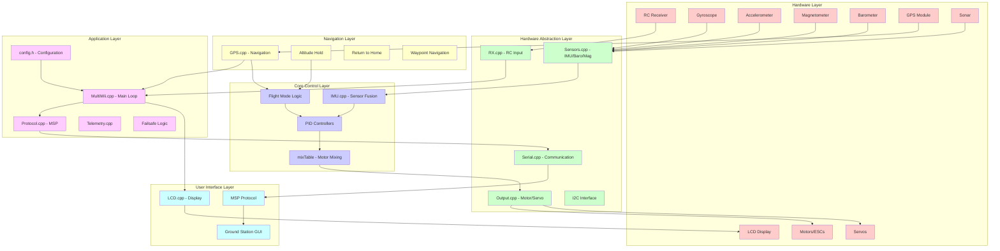

```mermaid
graph TB
    subgraph "Hardware Layer"
        RC[RC Receiver]
        GYRO[Gyroscope]
        ACC[Accelerometer]
        MAG[Magnetometer]
        BARO[Barometer]
        GPS[GPS Module]
        SONAR[Sonar]
        MOTORS[Motors/ESCs]
        SERVOS[Servos]
        LCD[LCD Display]
    end

    subgraph "Hardware Abstraction Layer"
        RX[RX.cpp - RC Input]
        SENSORS[Sensors.cpp - IMU/Baro/Mag]
        OUTPUT[Output.cpp - Motor/Servo]
        SERIAL[Serial.cpp - Communication]
        I2C[I2C Interface]
    end

    subgraph "Core Control Layer"
        IMU[IMU.cpp - Sensor Fusion]
        PID[PID Controllers]
        MIXER[mixTable - Motor Mixing]
        FLIGHT[Flight Mode Logic]
    end

    subgraph "Navigation Layer"
        GPS_NAV[GPS.cpp - Navigation]
        ALT[Altitude Hold]
        RTH[Return to Home]
        WAYPOINT[Waypoint Navigation]
    end

    subgraph "Application Layer"
        MAIN[MultiWii.cpp - Main Loop]
        CONFIG[config.h - Configuration]
        PROTOCOL[Protocol.cpp - MSP]
        TELEMETRY[Telemetry.cpp]
        FAILSAFE[Failsafe Logic]
    end

    subgraph "User Interface Layer"
        LCD_UI[LCD.cpp - Display]
        MSP[MSP Protocol]
        GUI[Ground Station GUI]
    end

    %% Hardware connections
    RC --> RX
    GYRO --> SENSORS
    ACC --> SENSORS
    MAG --> SENSORS
    BARO --> SENSORS
    GPS --> GPS_NAV
    SONAR --> SENSORS
    
    %% Data flow upward
    RX --> MAIN
    SENSORS --> IMU
    GPS_NAV --> MAIN
    
    %% Control flow
    IMU --> PID
    PID --> MIXER
    MIXER --> OUTPUT
    
    %% Output connections
    OUTPUT --> MOTORS
    OUTPUT --> SERVOS
    
    %% Configuration and monitoring
    CONFIG --> MAIN
    MAIN --> PROTOCOL
    PROTOCOL --> SERIAL
    SERIAL --> MSP
    MSP --> GUI
    
    %% Display
    MAIN --> LCD_UI
    LCD_UI --> LCD
    
    %% Navigation integration
    GPS_NAV --> FLIGHT
    ALT --> FLIGHT
    FLIGHT --> PID

    classDef hardware fill:#ffcccc
    classDef hal fill:#ccffcc
    classDef core fill:#ccccff
    classDef nav fill:#ffffcc
    classDef app fill:#ffccff
    classDef ui fill:#ccffff

    class RC,GYRO,ACC,MAG,BARO,GPS,SONAR,MOTORS,SERVOS,LCD hardware
    class RX,SENSORS,OUTPUT,SERIAL,I2C hal
    class IMU,PID,MIXER,FLIGHT core
    class GPS_NAV,ALT,RTH,WAYPOINT nav
    class MAIN,CONFIG,PROTOCOL,TELEMETRY,FAILSAFE app
    class LCD_UI,MSP,GUI ui
```